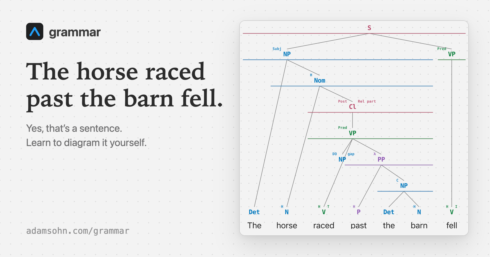

# Grammar

**Improve your grammar with sentence diagrams, not LLMs.**

Try it at **[adamsohn.com/grammar](https://adamsohn.com/grammar/)**.

Pick a sentence, split it into its parts, and label every piece yourself.



## What It Does

- Understand syntax by interacting with it — labeling the form and function of every word, phrase, and clause.
- There are 40 simple lessons and 400 practice sentences.
- It is frictionless, with hints and an animated solution for every practice sentence.

## For Contributors

```sh
npm install
npm run dev      # dev server
npm run all      # everything CI runs
```

SvelteKit 2 · Svelte 5 (runes) · TypeScript · Tailwind 4 · adapter-static.

## License

[MIT](LICENSE)
