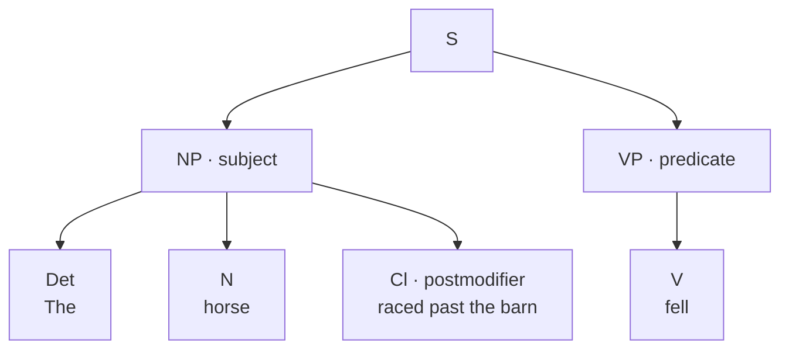
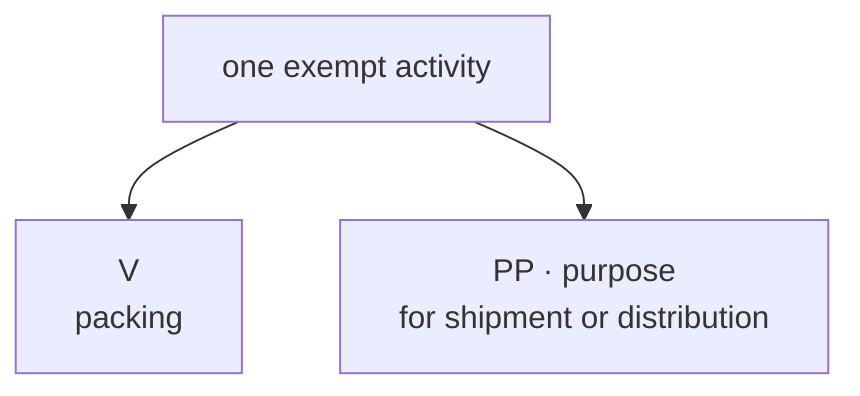
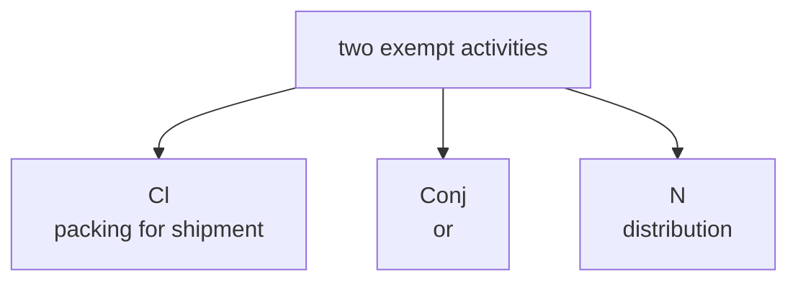
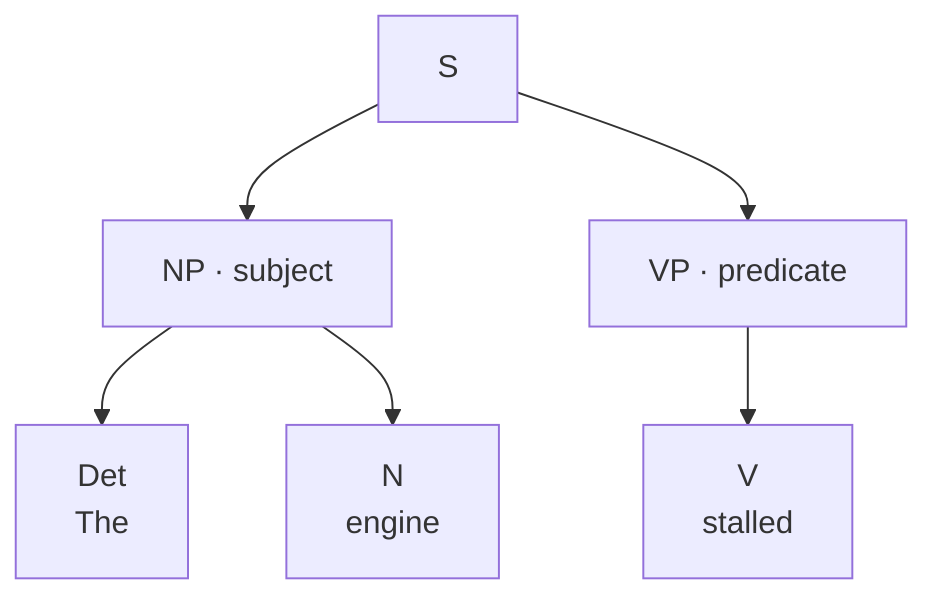

# 00 · Introduction

> **The horse raced past the barn fell.**

You know every word in that sentence, but _fell_ makes the sentence seem
broken. Read it again with two words restored: _The horse **that was** raced
past the barn fell._ Now the pieces come into view. One large piece names the
horse; the other tells what happened to it.

The diagram shows what the word meanings could not show by themselves: which
words belong together and what job each group performs. That arrangement is
called **sentence structure**, or **syntax**. The labels are short names for the
pieces, but the branches carry the main idea. Six words work together as the
subject. One word forms the predicate. Once you can see that frame, the sentence
stops looking like a row of words and starts making sense.

Structure matters outside a grammar exercise. In 2017, dairy drivers in Maine
went to court over the words _packing for shipment or distribution_. Did the
law describe one exempt activity—packing for either purpose—or two exempt
activities, packing and distribution? The court found that the wording allowed
the second reading. The case later settled for about five million dollars. The
words did not change between the readings. Only the branches did.

This app teaches you to make those branches yourself. You name a word, join
words that form one piece, and connect that piece to the job it performs. The
diagram grows above the sentence while every word stays in place. If a choice
does not fit, it does not land; you see the test that would have caught it. If
the sentence supports two readings, the app accepts both. Start with _The
engine stalled._ Find its two large pieces, and build the diagram below one
decision at a time.

